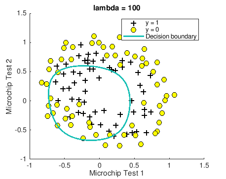

# Logistic Regression
## Completion Proof

## Figures
### Predicting University Acceptance based on Student Grades
#### Plotting data points...

#### Plotting boundary decision line...

### Predicting Microchips Acceptance/Rejection based on Q/A tests.
#### Plotting data points...

#### Plotting boundary decision line...

#### Visualizing Overfitting - Lambda is too small

#### Visualizing Underfitting - Lambda is too large

