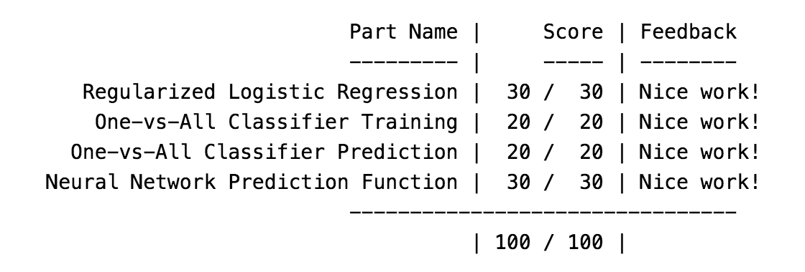
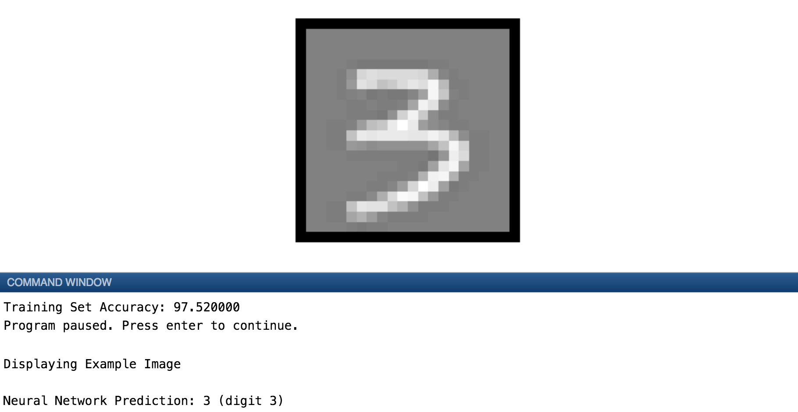
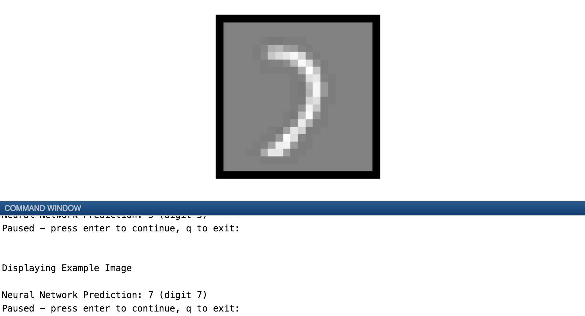
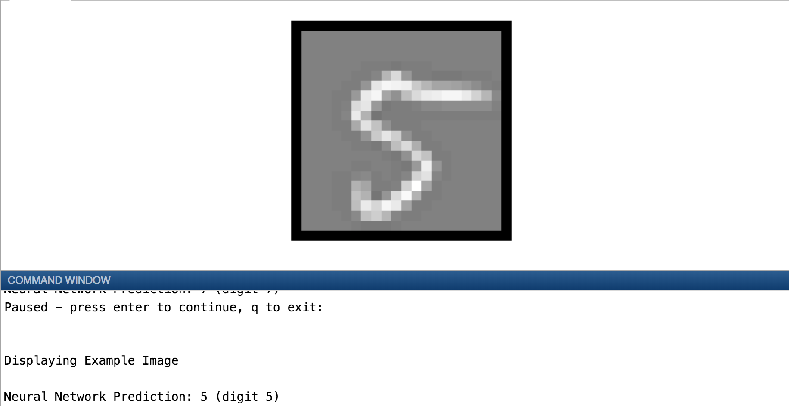
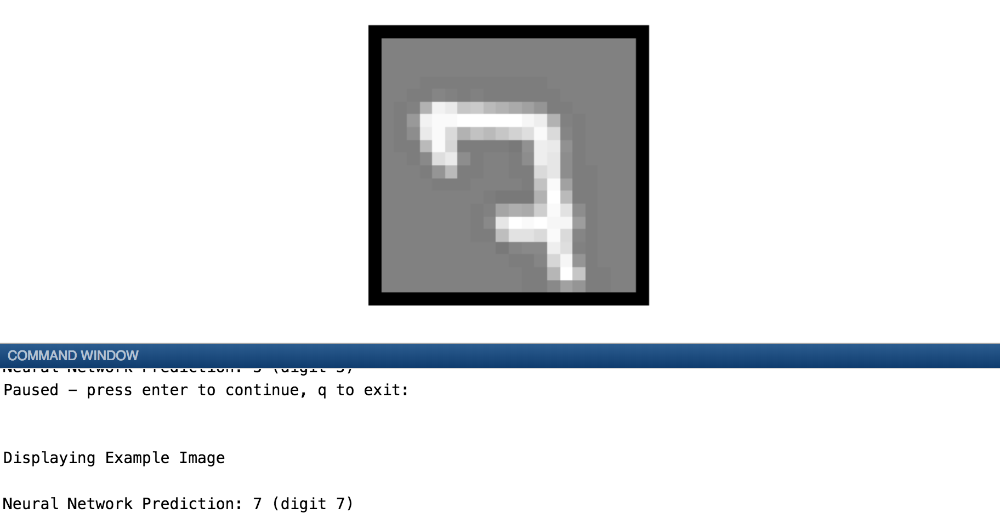

# Neural Networks: Multi-class Classification
## Figures
### Completion Proof

### Classifying hand-written digits (canonical "hello world" problem for ML) using LR
#### Visualizing subset of training data

### Neural Network: Feedforward Propagation Algorithm to predict hand-written digits
#### Training Accuracy - 97% - NN predictions

