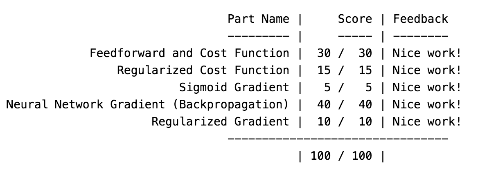
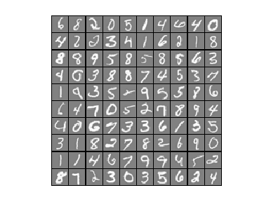
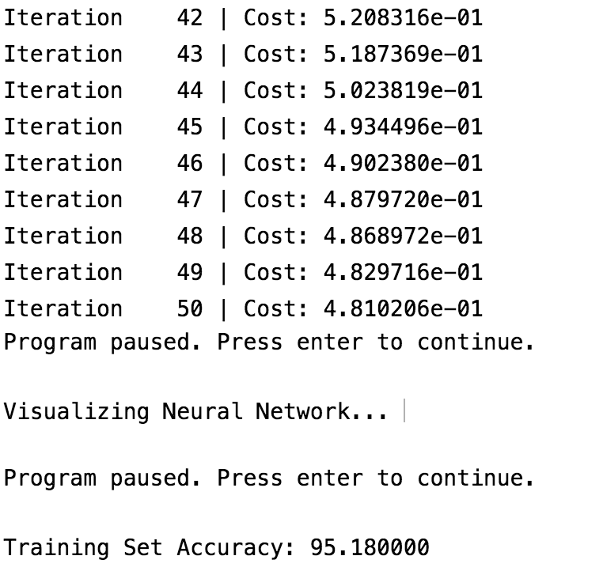
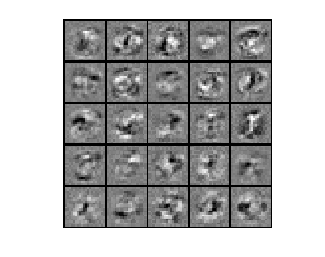

# Neural Networks: Learning
## Figures
### Completion Proof

### Classifying hand-written digits (canonical "hello world" problem for ML) using NN
#### Visualizing subset of training data

### Neural Network: Backpropagation Algorithm to train NN.
#### Training Accuracy - 95%

#### Visualizing Neural Networks

