# Linear Regression Diagnosis
## Completion Proof
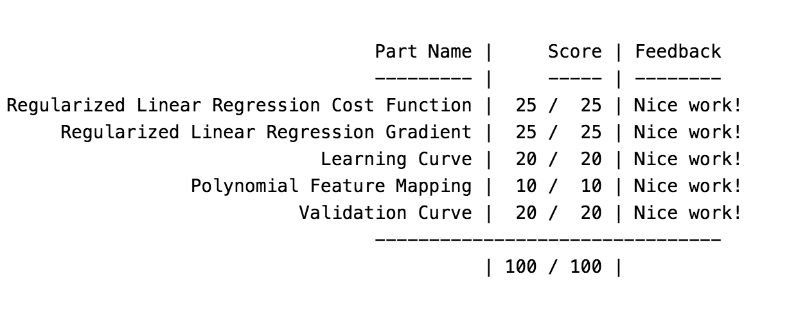
## Figures
### Predicting water flow using change on water level
#### Plotting data points...
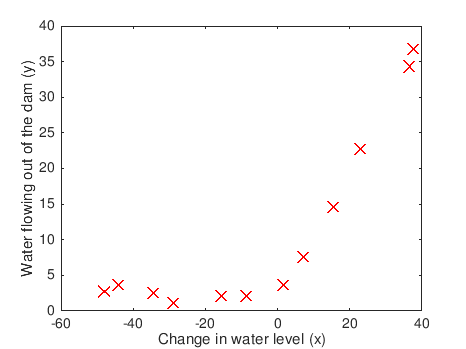
#### Fitting a straight line...
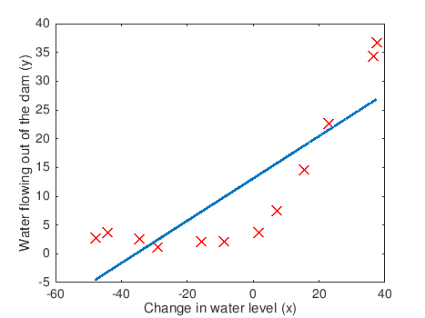
#### Plotting Learning Curve...
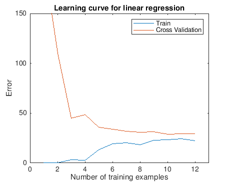
### Polynomial Fit - Studying change on Lambda
#### Setting Lambda = 0
##### Fitting polynomial hypothesis...
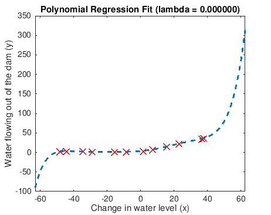
##### Plotting learning curve...
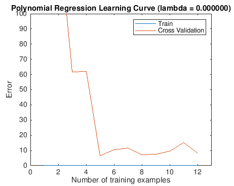
#### Setting Lambda = 1 (Overfitting)
##### Fitting polynomial hypothesis...
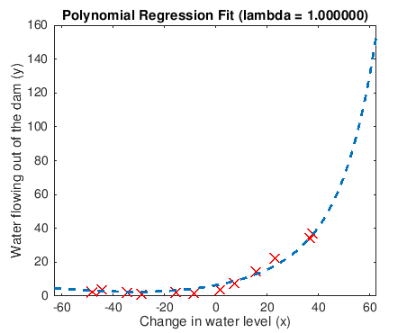
##### Plotting learning curve...
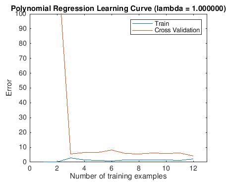
#### Setting Lambda = 100 (Underfitting)
##### Fitting polynomial hypothesis...
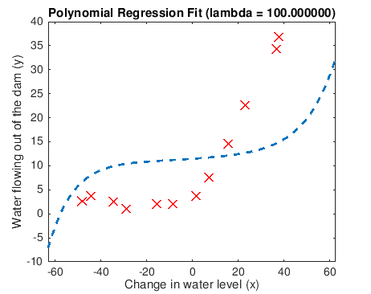
##### Plotting learning curve...
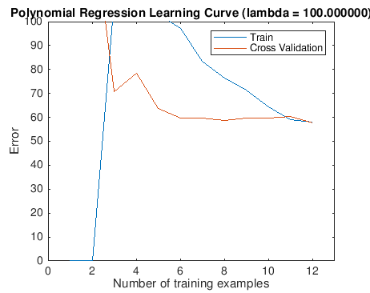
### Selecting Lambda with cross-validation set
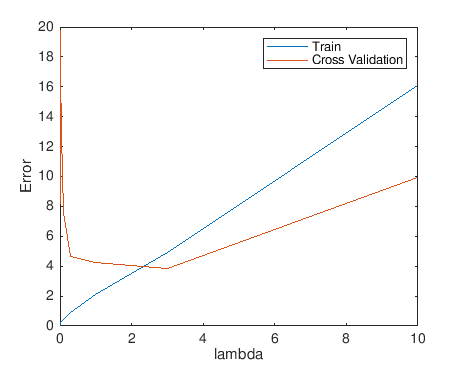
