# Support Vector Machines (SVMs)
## Completion Proof
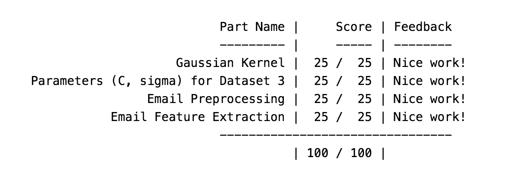
## Figures
### SVM: Linear Kernel
#### Visualizing Linearly Separable Dataset
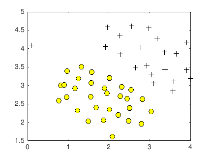
#### SVM Linear Desicion Bounderies
##### Plotting boundary line with C = 1
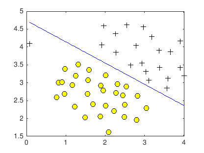
##### Plotting boundary line with C = 100
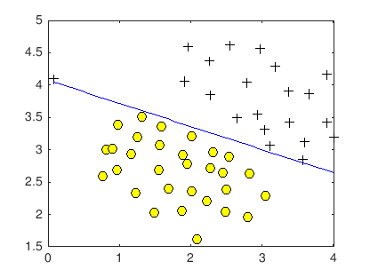
##### Plotting boundary line with C = 1000

### SVM: Gaussian Kernel
#### Visualizing Non-linearly Separable Dataset
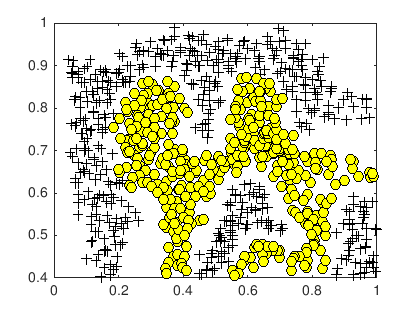
#### SVM Gaussian Decision Boundary
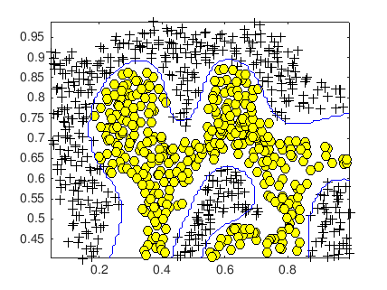
### SVM: RBF (Radial basis function) Kernel
#### Visualizing Smooth Non-linearly Separable Dataset
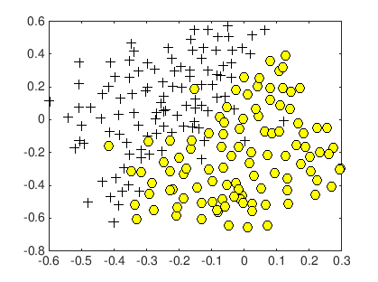
#### SVM RBF Decision Boundaries
##### Unoptimized Parameters (C & sigma)
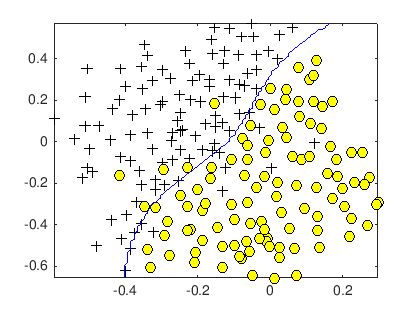
##### Optimized Parameters (C & sigma)
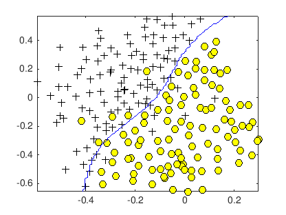

## SVM Application: Spam Classifier
### Training Spam Classifier - Accuracy and top predictors
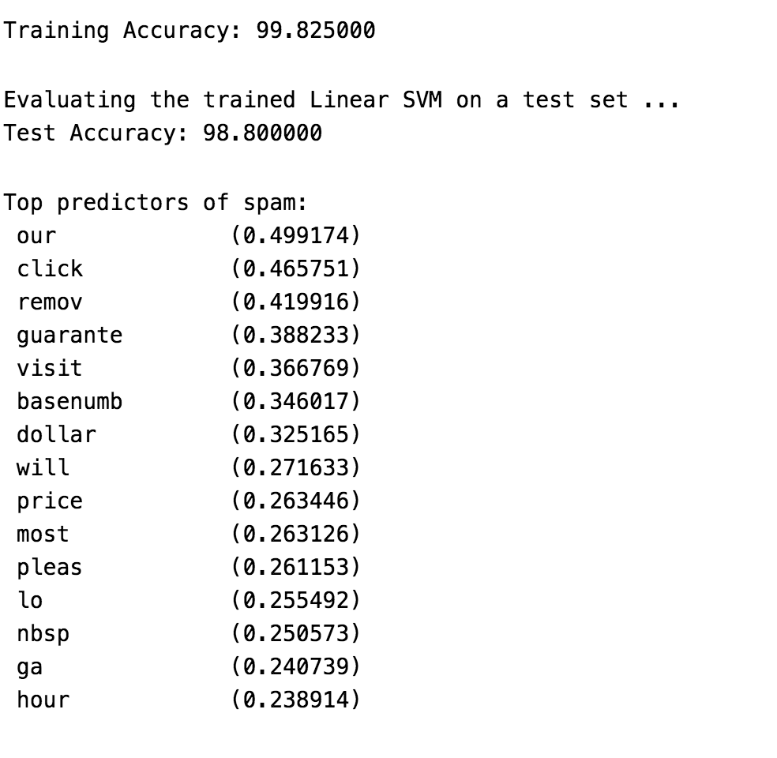
### Sample Spam Email
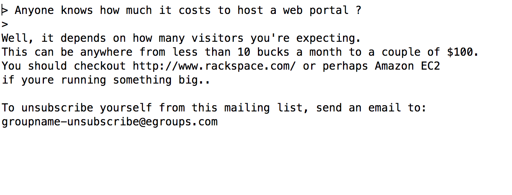
### Spam Classifier Preprocessing and Prediction
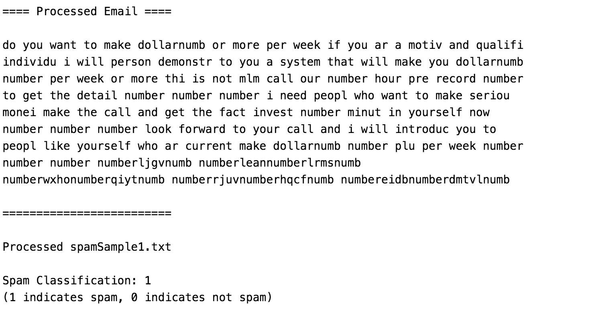
