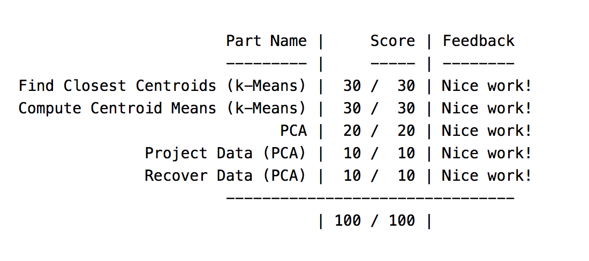
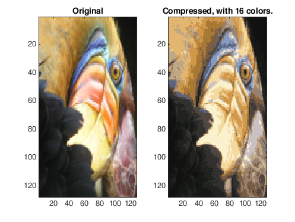
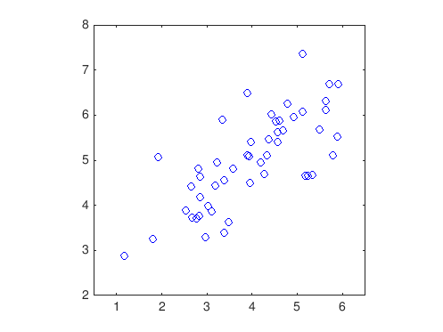
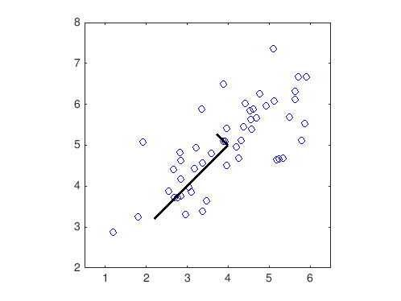
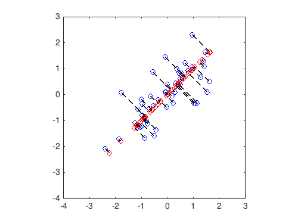
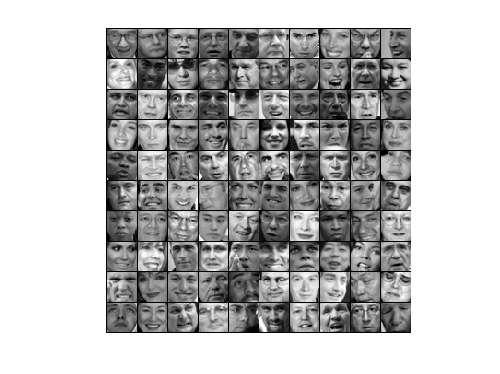
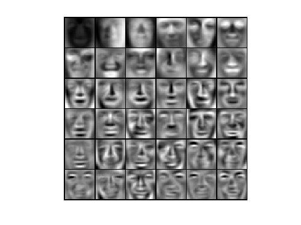
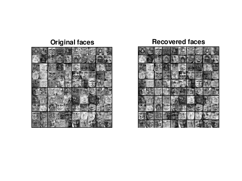
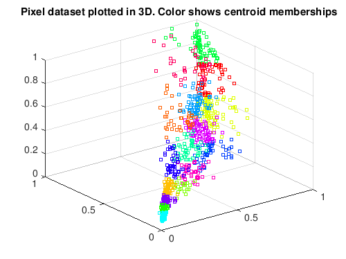
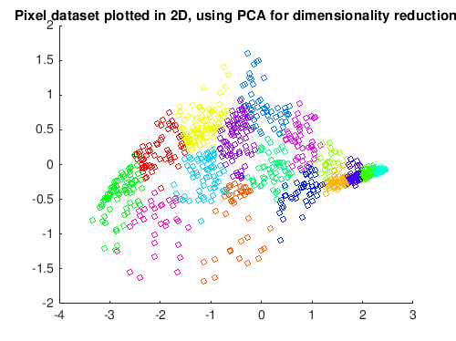

# Unsupervised Learning: K-Means Algorithm and Principal Component Analysis (PCA)
## Completion Proof

## Figures
### K-Means Algorithm
#### Computing Centroids

#### Image Compression

### Principal Component Analysys(PCA)
#### Applying PCA to Unlabeled Dataset

#### Computing eigenvectors on unlabeled dataset

#### Visualizing Normalized and Projected dataset

#### Applying PCA to Faces Dataset

#### Dimensionality Reduction on Faces Dataset

#### Original Data Recovery

#### Applying PCA to 3D Data

#### 2D Representation After PCA

