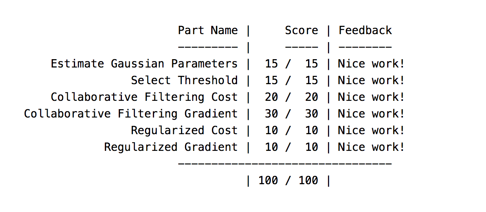
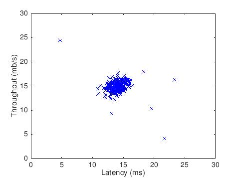
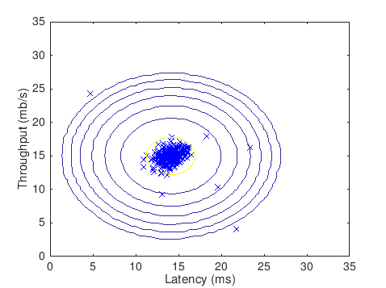
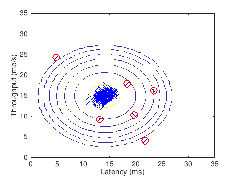
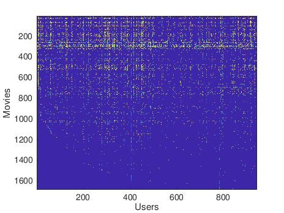
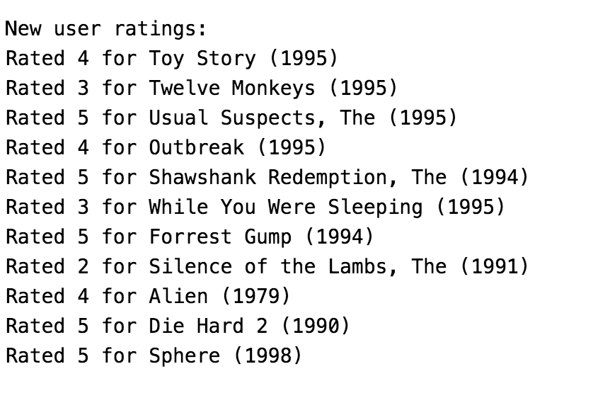
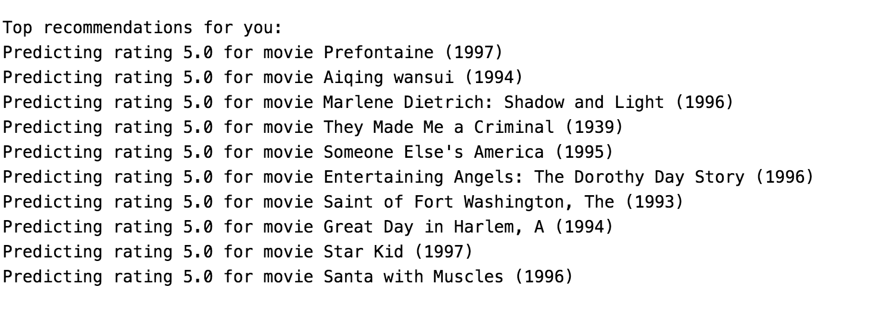

# Anomaly Detection and Recommender Systems
## Completion Proof

## Figures
### Anomaly Detection: Detecting faulty servers on a network
#### Visualizing dataset - Servers on a network

#### Contour Plot of Gaussian Distribution

#### Anomalies Found on Network Servers dataset

### Recommender Systems: Recommending Movies to Users
#### Plotting Movies User Ratings

#### New Users Movie Rating

#### My top Movie Recommendations

